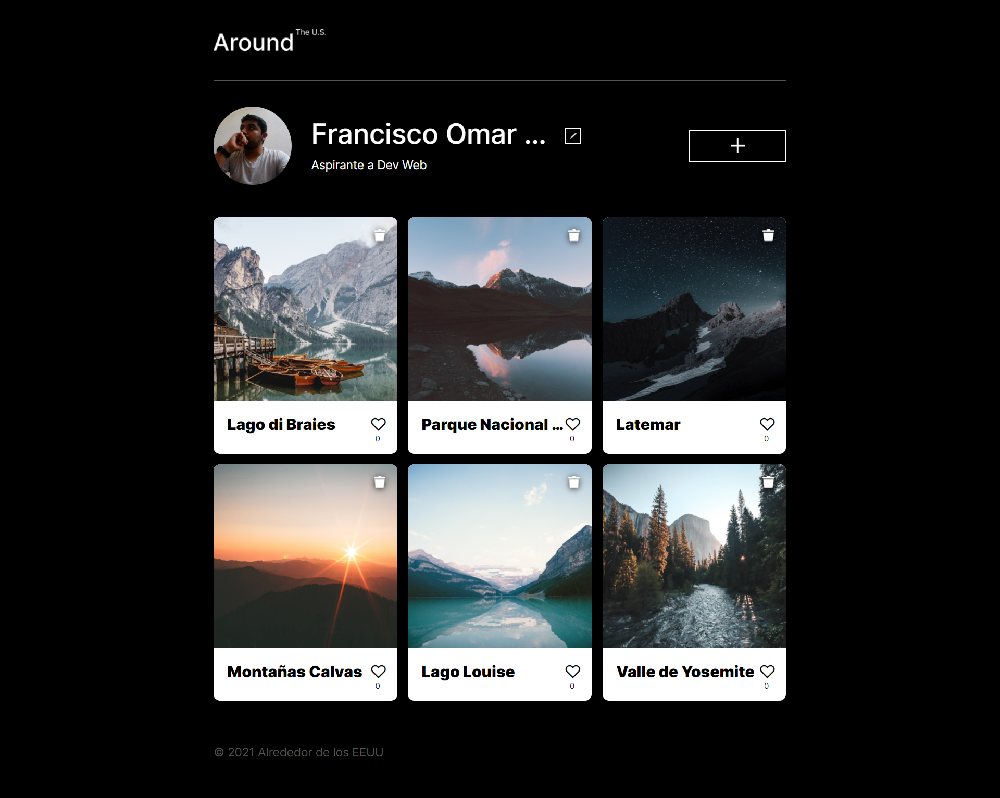
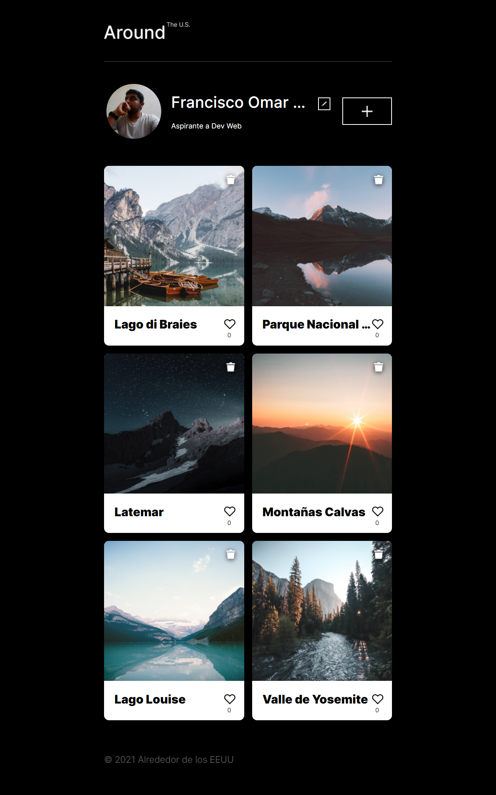
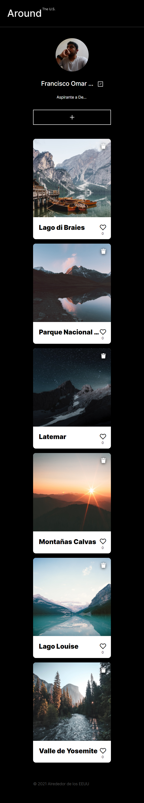

# Proyecto 4: Alrededor de los Estados Unidos en React

## Descripción general

- Introducción
- Vistas previas del proyecto
- Nota
- Autor

## Introducción

Este proyecto es el resultado de lo aprendido de los sprints: 4-11 del bootcamp **TripleTen** que estoy cursando actualmente, en donde aplique los aprendidos y mejorados, como flex-box, Grid Layout, metodología bem, transiciones, animaciones, buena maquitación, etc. Además de programación orientada a objetos (POO) haciendo uso de clases para los Popups, formularios y las cards, además realice solicitudes GET, PUSH, PUT y DELETE a una API, todo con JavaScript, para finalmente hacer la transición al framework react.

## Vistas previas del diseño responsivo del proyecto

### Vistas diseño para PC min-width 1024px

### Vistas diseño para tablets min-width 768px y max-width 1024px

### Vistas diseño para dispositivos móviles max-width 768px

## Nota

Toda la página web fue diseñado, en base al documentos proporcionado por el bootcamp, para la realicación del proyecto.

- [Enlace al proyecto en Figma utilizado para diseño de la web parte 1.](https://www.figma.com/file/zXzLVGc4KNVm3FMTsAnQnH/WEB%2C-Sprint-4%3A-Alrededor-de-los-EEUU-%7C-desktop-%2B-mobile?node-id=0-1&t=4NePpZYhpOSuxWfA-0)

- [Enlace al proyecto en Figma utilizado para diseño de la web parte 2.](https://www.figma.com/file/EGCbebw7k4kMOWt2qQcpEu/Web_Brief_Sprint_10_ES-%7C-JavaScript-aplicado?type=design&node-id=1-352&mode=design)

Para ver el resultado del proyecto final, da click al siguiente enlace.

- [Enlace al citio web.](https://Frank345-sys.github.io/web_project_around_react/)

## Autor

Francisco Omar Habib González Utrera 2023
